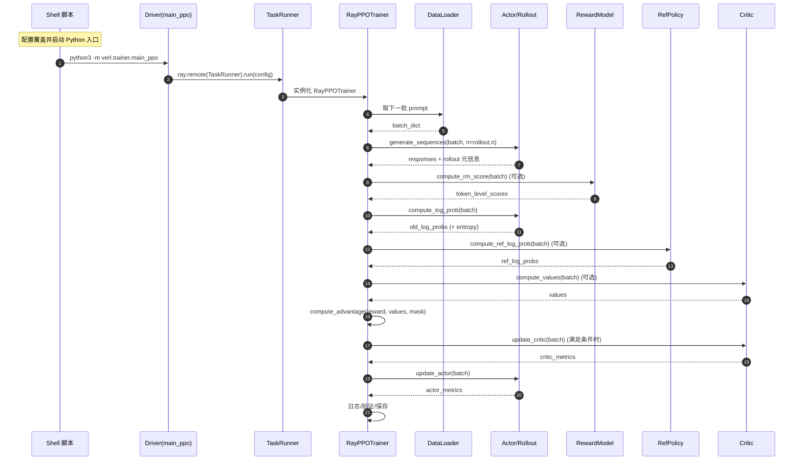

# VERL Actor/Rollout、Critic、RewardModel、RefPolicy 交互报告

## 目录
- [1. 背景与角色概览](#1-背景与角色概览)
- [2. 时序与交互总览](#2-时序与交互总览)
- [3. 角色职责与接口细节](#3-角色职责与接口细节)
- [4. 关键代码映射](#4-关键代码映射)
- [5. 运行要点与实践建议](#5-运行要点与实践建议)

---

## 1. 背景与角色概览

### 1.1 场景背景
- `run_qwen2-7b_math.sh` 通过 Hydra 将 `verl.trainer.main_ppo` 作为入口，组合数据、模型与训练超参，启动 Ray 集群并触发 PPO/GPG 训练流程。
- 训练驱动流程可参考《VERL_PPO_启动流程完整报告》所述的 Driver → TaskRunner → RayPPOTrainer 分层结构，本报告聚焦四个核心 Worker 角色的交互。

### 1.2 角色速览
- **Actor/Rollout**：负责提示生成与策略更新，包含 rollout（推理）与 actor（优化）双重职责。
- **Critic**：估计价值函数，为优势计算提供 baseline，并参与价值网络训练。
- **RewardModel**：对生成结果进行评分，提供 token/序列级奖励。
- **RefPolicy**：可选参考策略，用于 KL/GPG 等约束或指标。

---

## 2. 时序与交互总览

### 2.1 全局交互时序图


### 2.2 交互流程概述
- **配置阶段**：Shell 脚本决定数据源、模型路径、GPG 模式等超参，Hydra 合并默认配置并下发给 Driver。
- **资源与 Worker 初始化**：TaskRunner 按角色注册 Worker 类，并使用 `ResourcePoolManager` 分配 GPU 资源。
- **训练主循环**：RayPPOTrainer 驱动数据加载 → 生成 → 奖励 → 对数概率 → 价值 → 优势 → 更新 → 评估的完整链路。
- **条件分支**：Critic、RewardModel、RefPolicy 是否参与取决于配置；GPG 模式下 Actor 必须启用策略损失中的参考对比逻辑。

---

## 3. 角色职责与接口细节

### 3.1 Actor/Rollout
- **核心职责**
  - rollout：使用 vLLM/FSDP 混合引擎生成响应（支持重复 `n` 次）。
  - actor：计算当前策略 log-prob，执行梯度更新，输出损失/熵等指标。
- **主要输入**：prompt 批次、mask、奖励、优势、重要性采样权重等。
- **主要输出**：生成响应、`old_log_probs`、更新后的指标、可选的参考 log_probs（当 `ref_in_actor=True`）。
- **关键交互**
  - 先生成后更新，生成结果与奖励合并；
  - 在更新前需重新计算 log-prob 与熵；
  - 更新阶段读取优势、奖励、mask 等数据。

### 3.2 Critic
- **核心职责**：输出 `values`，提供优势计算基线，并在 warmup 结束后参与反向更新。
- **主要输入**：包含响应及奖励的 batch。
- **主要输出**：`values` 张量、更新指标（loss、梯度范数等）。
- **关键交互**
  - Advantage 计算之前提供 values；
  - `update_critic` 在 Actor 更新前执行，可配置 warmup 步数。

### 3.3 RewardModel
- **核心职责**：计算 token 级奖励，可能组合模型、规则、工具评分。
- **主要输入**：生成后的 batch（含 prompt/response）。
- **主要输出**：`token_level_scores`（同步模式）或异步 future；可附加额外信息以用于日志。
- **关键交互**
  - RewardModel 可在独立资源池运行；
  - 当异步启动时，RayPPOTrainer 会在优势计算前 `ray.get` 结果。

### 3.4 RefPolicy
- **核心职责**：提供参考策略 log-prob，用于 KL 惩罚或 GPG 策略损失比较。
- **主要输入**：与 Actor 相同的 batch（共享响应与 mask）。
- **主要输出**：`ref_log_prob` 张量。
- **关键交互**
  - 当 `actor_rollout_ref.actor.use_kl_loss` 或 `algorithm.use_kl_in_reward` 为真时自动启用；
  - 若配置 LoRA/Adapter，默认复用 Actor Worker（`ref_in_actor=True`）。

---

## 4. 关键代码映射

```14:52:/root/userdata/huzx/verl/examples/gpg_trainer/run_qwen2-7b_math.sh
python3 -m verl.trainer.main_ppo \
    algorithm.adv_estimator=gpg \
    data.train_files="$train_files" \
    ...
    trainer.total_epochs=15 $@
```

```256:336:/root/userdata/huzx/verl/verl/trainer/main_ppo.py
actor_rollout_cls, ray_worker_group_cls = self.add_actor_rollout_worker(config)
self.add_critic_worker(config)
...
trainer = RayPPOTrainer(
    config=config,
    tokenizer=tokenizer,
    processor=processor,
    role_worker_mapping=self.role_worker_mapping,
    resource_pool_manager=resource_pool_manager,
    ...
)
trainer.init_workers()
trainer.fit()
```

```1074:1253:/root/userdata/huzx/verl/verl/trainer/ppo/ray_trainer.py
batch: DataProto = DataProto.from_single_dict(batch_dict)
...
if self.use_rm and "rm_scores" not in batch.batch.keys():
    reward_tensor = self.rm_wg.compute_rm_score(batch)
...
old_log_prob = self.actor_rollout_wg.compute_log_prob(batch)
...
if self.use_reference_policy:
    ref_log_prob = self.ref_policy_wg.compute_ref_log_prob(batch)
...
if self.use_critic:
    values = self.critic_wg.compute_values(batch)
...
critic_output = self.critic_wg.update_critic(batch)
...
actor_output = self.actor_rollout_wg.update_actor(batch)
```

---

## 5. 运行要点与实践建议
- **配置协同**：脚本中 `algorithm.adv_estimator=gpg` 与 `actor.policy_loss.loss_mode=gpg` 搭配启用 GPG 损失，需确保 RewardModel 和 RefPolicy 的可用性以支持奖励与差异计算。
- **资源规划**：`actor_rollout_ref.rollout.tensor_model_parallel_size=2`、`ppo_micro_batch_size_per_gpu=16` 等参数直接影响 Actor Worker 的并行拓扑，Critic/RewardModel 默认共享 `global_pool`。
- **性能调优**：可根据场景启用 `rollout.mode=async`、`trainer.balance_batch`、`algorithm.rollout_is` 等特性，以提升吞吐或减弱策略漂移。
- **监控指标**：建议重点关注 Actor 熵、Critic 损失、`mismatch/*` 指标及验证奖励，配合 `save_freq`、`test_freq` 制定回滚与评估策略。
